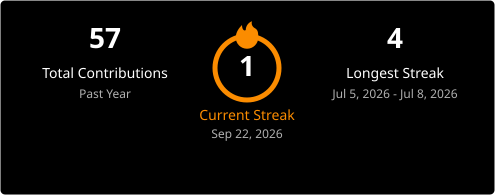

# 👋 Hi, I'm Halit Tiryaki

### Python Developer • Automation Engineer • Desktop Application Developer

Building software that saves businesses time through automation.

[🌐 Portfolio](https://halittiryaki.com)
&nbsp;&nbsp;•&nbsp;&nbsp;
[💻 GitHub](https://github.com/halittiryakicom)

---

# 🚀 Available for Freelance Projects

✔ Python Automation

✔ Excel Automation

✔ Desktop Applications

✔ Business Process Automation

✔ Web Scraping

✔ WordPress Development

✔ Custom Software Solutions

---

# 👨‍💻 About Me

I'm a Python developer passionate about building automation software that eliminates repetitive work and improves productivity.

I specialize in desktop applications, Excel automation, web scraping, business process automation, and custom software development.

My goal is to create reliable, user-friendly software with clean architecture and professional user experiences.

---

# 📌 Featured Projects

## 📊 Excel Automation Toolkit

Modern desktop application built with **Python** and **PySide6** for Excel automation.

### Highlights

- Drag & Drop Support
- Recent Files
- Excel Cleaning
- Statistics Dashboard
- Automatic Chart Generation
- PDF Report Support
- Modern Desktop UI

**Tech Stack**

`Python` `PySide6` `Pandas` `Matplotlib` `OpenPyXL`

🔗 https://github.com/halittiryakicom/excel-automation-toolkit

---

## 🌐 Python Web Scraper

Professional Python toolkit for collecting and processing website data.

**Current Development**

- Web Scraping
- CSS Selectors
- XPath Support
- Custom User-Agent
- Timeout Handling
- Error Handling

---

## 📄 PDF Report Generator

Generate professional PDF reports automatically using Python.

**Planned Features**

- PDF Templates
- Charts
- Statistics
- Export Automation

---

## 🌍 Personal Portfolio Website

Personal portfolio developed using **ASP.NET Core MVC**.

Features

- Portfolio
- Projects
- Blog
- SEO
- Contact
- Responsive Design

🔗 https://halittiryaki.com

---

# 🛠 Tech Stack

### Languages

### Frameworks

### Libraries

### CMS

### Tools

---

# 📈 GitHub Statistics

---

# 📈 Contribution Graph

<!-- BEGIN ACTIVITY-GRAPH -->
<picture>
  <source media="(max-width: 767px)" srcset="activity-graph-mobile.svg">
  
</picture>
<!-- END ACTIVITY-GRAPH -->

---

# 🎯 Current Focus

- 📊 Excel Automation Toolkit
- 🌐 Python Web Scraper
- 📄 PDF Report Generator
- 🌍 WordPress Development
- ⚙ Office Automation Toolkit
- 💼 Freelance Software Development

---

# 💼 Services

- Python Automation
- Excel Automation
- Desktop Applications
- Web Scraping
- WordPress Development
- Business Process Automation
- Custom Software Development

---

# 🎯 2027 Goals

- 🌐 **Python Web Scraper** — build the core scraping engine (CSS/XPath selectors, CSV export)
- 🗂 **Office Automation Toolkit** — ship the first MVP (PDF Merge, Bulk Rename, File Organizer)
- 🎮 **QuizApp** — ship the live room-based exam mode
- 📊 **Excel Automation Toolkit** — next feature release

---

# 📬 Connect

🌐 Website

https://halittiryaki.com

💻 GitHub

https://github.com/halittiryakicom

✉ Email

halittiryaki1461@gmail.com

---

## ⭐ Thanks for visiting!

Building software that saves businesses time through automation.

If you like my work, don't forget to ⭐ my repositories.

